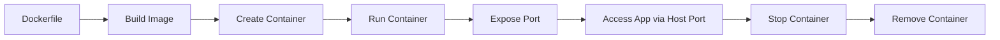
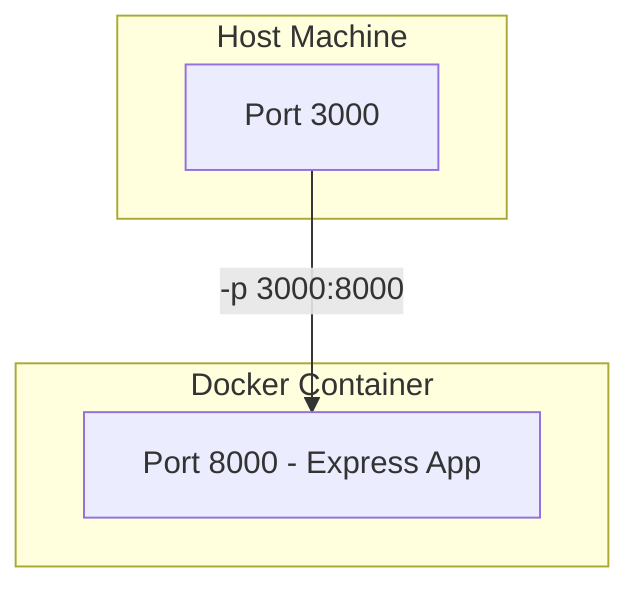

---

```markdown
# 🚀 Dockerized Node.js Express Application

A simple yet powerful Express.js application containerized with Docker. This project demonstrates the core concepts of Docker while maintaining a clean and efficient workflow.

---

## 📦 What's Inside

- ✅ Node.js Express server with two routes
- 🐳 Dockerfile using Alpine (minimal base image)
- 🛠️ Docker lifecycle management walkthrough
- 🧠 Essential Docker commands & cheat sheet
- 📈 Visual diagrams for better understanding

---

## 🌐 Application Endpoints

- Homepage: [`http://localhost:3000`](http://localhost:3000)
- Products API: [`http://localhost:3000/product`](http://localhost:3000/product)

---

## 🐳 Docker Concepts in Action

### 🔧 Core Docker Concepts

| Concept         | Description                                      |
|-----------------|--------------------------------------------------|
| **Images**      | Lightweight base: `node:20-alpine3.18`           |
| **Containers**  | Running instances from images                    |
| **Port Mapping**| Host ↔️ Container communication via `-p` flag    |
| **Layered Builds** | Optimized with caching for faster builds     |

---

## 🏗️ Dockerfile Breakdown

```Dockerfile
# 1. Lightweight base image
FROM node:20-alpine3.18

# 2. Working directory setup
WORKDIR /app

# 3. Copy dependency files first (layer caching)
COPY package.json .
COPY package-lock.json .

# 4. Install dependencies
RUN npm install

# 5. Copy remaining source code
COPY . .

# 6. Define the command to run app
CMD ["npm", "start"]
```

---

## ⚙️ Setup & Usage

### 📌 Build the Docker Image
```bash
docker build -t expressapp .
```

### 🚀 Run the Container
```bash
docker run -it -p 3000:8000 --name express_container expressapp
```

### 🌍 Access the App
- Homepage: `http://localhost:3000`
- Products API: `http://localhost:3000/product`

---

## 🔄 Docker Lifecycle Diagram



---

## 🌐 Port Mapping Overview



---

## 🧠 Key Takeaways

1. **Alpine Base Image**: Secure, minimal, faster to download
2. **Layer Caching**: Copy `package.json` before app files to speed rebuilds
3. **Port Mapping**: `-p HOST_PORT:CONTAINER_PORT` allows external access
4. **Container Lifecycle**: Build → Run → Stop → Remove

---

## 📋 Docker Commands Cheat Sheet

### 🔍 Container Management
| Command | Description |
|--------|-------------|
| `docker ps` | List running containers |
| `docker ps -a` | List all containers |
| `docker stop <id>` | Stop container |
| `docker rm <id>` | Remove container |
| `docker run --name <name>` | Run and name a container |

### 🧱 Image Management
| Command | Description |
|--------|-------------|
| `docker images` | List images |
| `docker rmi <image>` | Remove image |
| `docker build -t <tag>` | Build image with a tag |

### 🏷️ Flags You Should Know
| Flag | Description | Example |
|------|-------------|---------|
| `-it` | Interactive Terminal | `docker run -it alpine sh` |
| `-p` | Port Mapping | `-p 3000:8000` |
| `--rm` | Auto-remove container after exit | `docker run --rm alpine` |

---

## 🔮 Next Steps 

- [ ] Implement **multi-stage builds** for smaller production images
- [ ] Use **Docker Compose** to manage multi-container apps
- [ ] Add **health checks** in your Dockerfile
- [ ] Learn about Docker **volumes and networks**
- [ ] Set up **CI/CD pipelines** using GitHub Actions or GitLab CI

---

## 📚 Resources

- 📘 [Official Docker Docs](https://docs.docker.com/)
- 🧠 [Node.js Docker Best Practices](https://nodejs.org/en/docs/guides/nodejs-docker-webapp/)
- 📄 [Dockerfile Reference Guide](https://docs.docker.com/engine/reference/builder/)

---

## 🙌 Contributing

Contributions, issues, and feature requests are welcome!

---

## 📄 License

This project is licensed under the MIT License.

```

---
